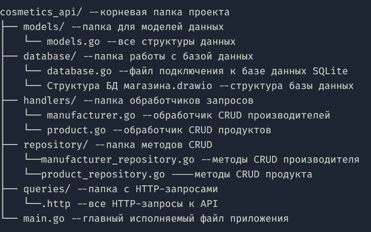

# cosmetics_api
Pепозиторий проекта RESTful API для управления базой данных косметических продуктов. 
# Cтруктура базы данных
База данных проекта состоит из трех таблиц, связанных друг с другом, чтобы хранить информацию о косметических продуктах, их производителях и составе.

#### Таблица manufacturer: Содержит информацию о производителях.

    manufacturer_id (INTEGER, PRIMARY KEY)

    manufacturer_title (TEXT)

    country (TEXT)

    address (TEXT)

    contact_list (TEXT)

#### Таблица products: Хранит данные о продуктах.

    product_id (INTEGER, PRIMARY KEY)

    product_title (TEXT)

    product_description (TEXT)

    expiration_date (TEXT)

    contraindications (TEXT, может быть NULL)

    application (TEXT)

    volume (TEXT)

    manufacturer_id (INTEGER, FOREIGN KEY, ссылается на manufacturer)

#### Таблица structure: Содержит список компонентов или ингредиентов.

    structure_id (INTEGER, PRIMARY KEY)

    structure_name (TEXT)

#### Таблица product_structure: Таблица связи "многие ко многим" между продуктами и их составом.

    product_id (INTEGER, FOREIGN KEY, ссылается на products)

    structure_id (INTEGER, FOREIGN KEY, ссылается на structure)

# Cтруктура проекта

